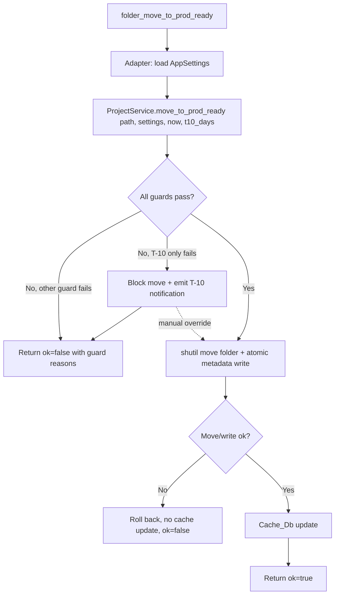

# Design Document

## Overview

This design completes the remaining deferred functionality of PRD v3.1 on top of the existing,
verified Release Candidate. It is a **brownfield** design: the layered architecture, the service
layer, the SQLite cache, and the `JsApi` bridge surface already exist and pass the Linux test
suite. The central insight that shapes this design is:

> Most of the required `JsApi` bridge methods **already exist** in
> `project_tracker/web/js_api.py` (e.g. `folder_move_to_prod_ready`, `folder_postpone`,
> `folder_reopen`, `project_rename`, `subproject_delete`, `file_open`, `scheduler_start`,
> `automation_list_rules`, `second_brain_pin`). They currently return a controlled
> `*_FAILED` / `SERVICE_UNAVAILABLE` Bridge_Response because the adapters wired in
> `create_js_api()` (in `project_tracker/app_web.py`) deliberately set the corresponding
> service hooks to `None`.

Therefore the deferred work is mostly **wiring existing methods to real service logic through
the adapter pattern**, plus a small number of **genuinely new** bridge methods (project delete,
file create/rename/delete, Outlook draft/send/contacts/download, Teams preview/auto-send,
scheduler entry CRUD, rules CRUD, Second Brain note CRUD). No JsApi signature changes are needed
for the existing methods; new methods are added and wired before any frontend call uses them
(Requirement 1.3).

This design is organized by component/area and traces to the 15 requirements in
`requirements.md`. It honors the locked constraints: layered dependency direction, no new
dependencies, `pathlib` everywhere, atomic JSON writes, `send2trash`-only deletion,
`project_state` never persisted in `project_data.json`, ISO-8601 tz-aware datetimes, Windows
path preservation, and the four-check Verification_Suite per change.

## Architecture

### Layered Recap (unchanged, enforced)

```
frontend (Svelte/TS)  →  bridge (web/js_api.py via create_js_api adapters)
                         →  services (project/automation/scheduler/second_brain/notification/…)
                            →  core (enums, models, state_machine, rules)  +  infrastructure
                               (metadata_store, settings_store, link_bank_store, cache_db,
                                filesystem, outlook_client, teams_client, safe_delete_service)
```

Dependency rules are unchanged: `frontend → bridge only`; `bridge → services`;
`services → core + infrastructure`; `core` stays pure. The frontend touches Python only via
`callBridge` in `frontend/src/lib/bridge.ts`; `window.pywebview` is referenced nowhere else.

### Bridge Call Flow

```mermaid
sequenceDiagram
    participant UI as Svelte Component
    participant CM as ConfirmModal (Svelte)
    participant BR as bridge.ts callBridge
    participant API as JsApi method (js_api.py)
    participant AD as Adapter (create_js_api)
    participant SVC as Service
    participant FS as Infrastructure

    UI->>CM: high-risk action requested
    CM-->>UI: user confirms (or cancels → stop)
    UI->>BR: callBridge("folder_postpone", path)
    BR->>API: window.pywebview.api.folder_postpone(path)
    API->>AD: self._project_service.postpone_project(path)
    AD->>SVC: ProjectService.postpone_project(path, settings)
    SVC->>FS: guard check + move folder + atomic metadata write
    FS-->>SVC: result (Path | GuardResult)
    SVC-->>AD: result
    AD-->>API: dict | raises
    API-->>BR: { ok, data|error }
    BR-->>UI: BridgeResponse<T>
    UI-->>UI: success → refresh; ok=false → show error.message
```

### Folder Transition Flow (guards + rollback)



### Design Decisions (brownfield constraints)

1. **Wire, don't rewrite.** Existing `JsApi` methods keep their signatures. The work happens in
   the `_ProjectServiceAdapter`, `_FileServiceAdapter`, `_NotesServiceAdapter`, `_SettingsAdapter`,
   `_LinkBankAdapter`, and new adapters inside `create_js_api()`. Adapter hooks currently set to
   `None` (e.g. `rename_project`, `open_folder`) are replaced with real implementations
   (Requirement 1.8: no signature change unless proven necessary).
2. **New methods only where the capability is absent.** Genuinely new JsApi methods:
   `project_delete`, `file_create`, `file_create_from_template`, `file_rename`, `file_delete`,
   `outlook_draft_email`, `outlook_send_email`, `outlook_get_contacts`, `outlook_download_emails`,
   `teams_preview_message`, `teams_send_message`, `scheduler_entry_list/create/update/delete/toggle`,
   `rules_create/update/delete/toggle/get_logs`, `second_brain_note_create/write/delete`. Each is
   added to `js_api.py` and wired in `create_js_api()` in the same change, before frontend use.
3. **No new dependencies.** Everything uses the PRD v3.1 baseline (pywin32, pyautogui, pyperclip,
   send2trash, apscheduler) plus stdlib.
4. **No real-folder destructive operations in dev/tests.** All destructive paths are exercised
   only against a `Temp_Root`; a path-guard helper enforces this (Requirement 2.1/2.9).
5. **Legacy `AppAPI` is not extended.** The older `AppAPI` HTML bridge class in `app_web.py` is
   legacy; production wiring goes through `create_js_api()` / `JsApi` only.

## Components and Interfaces

### 1. Bridge contract & frontend safety (Req 1)

- **`frontend/src/lib/bridge.ts`** — extend `callBridge` with:
  - A 30-second timeout wrapper (`Promise.race`) → on timeout returns
    `{ ok: false, error: { code: "BRIDGE_TIMEOUT", … } }` (Req 1.8).
  - A malformed-response guard: when `raw` is object-with-`ok` but missing `error`/`data`
    consistency, treat as failed (`BRIDGE_MALFORMED_RESPONSE`).
  - Keep existing `BRIDGE_UNAVAILABLE` / `BRIDGE_METHOD_MISSING` / `BRIDGE_CALL_FAILED`.
- **`web/js_api.py`** — continue using the existing `ok()` / `fail(code=…)` helpers and the
  `BridgeResponse` dataclass; new methods follow the same `try/except → fail(code=…)` shape with
  stable uppercase codes (Req 1.4–1.6).
- **No-invented-contract gate:** a test enumerates every `callBridge("…")` literal in the
  frontend and asserts it maps to a real `JsApi` attribute on the object returned by
  `create_js_api()` (Req 1.2/1.3).

### 2. Filesystem safety (Req 2)

- **`infrastructure/filesystem.py`** — add a `assert_within(base: Path, target: Path)` guard used
  by all destructive helpers; raises a domain error when `target` is not within `base`
  (Req 2.1/2.9). Tests pass a `Temp_Root` base.
- **`services/safe_delete_service.py`** (`SafeDeleteService.delete_to_trash`) is the single
  deletion route via `send2trash` for project/subproject/file/note (Req 2.2).
- **`infrastructure/metadata_store.py`** — reuse the existing atomic temp-file-then-replace write;
  add an explicit failure path that preserves the target on partial write (Req 2.10).
- Datetime handling reuses `core.models.local_now()` and `_parse_optional_datetime` (tz-aware,
  Req 2.6); Windows path strings are stored verbatim by `SettingsStore` (Req 2.7).
- Cache rebuild via `CacheDb` + `ScannerService` already implements integrity-check rebuild;
  design reaffirms it remains non-authoritative (Req 2.8).

### 3. Confirmation & disabled-state UI (Req 3)

- **New `frontend/src/lib/components/ConfirmModal.svelte`** — props: `title`, `actionLabel`,
  `targetName`, `reversible: boolean | "unknown"`, `onConfirm`, `onCancel`. Renders reversibility
  as an explicit "This action is reversible/irreversible" line; "unknown" → irreversible
  (Req 3.2/3.3). No bridge call until `onConfirm` (Req 3.1); cancel/dismiss restores prior state
  (Req 3.4).
- **New `frontend/src/lib/components/DisabledHint.svelte`** (or a shared util) — renders the
  disabled control with a `title`/inline message that names the Folder_State lock or the deferred
  status (Req 3.5/3.6).
- **Lock model (frontend):** a small `folderLocks.ts` helper maps `project_state` → which actions
  are disabled (mirrors PRD §9.5), e.g. PROD_READY disables rename/delete/file-mutations;
  IMPLEMENTED disables everything except notes view. The backend remains the authoritative guard.
- On `ok=false`, the calling component shows `error.message` and leaves state unchanged
  (Req 3.7).

### 4. Folder transitions (Req 4)

- **`web/js_api.py`**: existing `folder_move_to_prod_ready`, `folder_move_to_implemented`,
  `folder_postpone`, `folder_cancel`, `folder_resume`, `folder_reopen` are reused.
- **`create_js_api()` `_ProjectServiceAdapter`**: implement the transition hooks (currently the
  adapter forwards only read methods). Each hook:
  1. loads `AppSettings` from the injected `SettingsStore`,
  2. calls the matching `ProjectService` method
     (`move_to_prod_ready(path, settings, local_now(), settings.t10_threshold_days)`,
     `move_to_implemented`, `postpone_project`, `cancel_project`, `resume_project`,
     `reopen_project`),
  3. inspects the result: a `GuardResult` with `allowed == False` → return `ok=false` with
     `"; ".join(result.reasons)` and `warnings` (Req 4.3/4.9/4.10); a `Path` → success,
  4. on success, calls `ScannerService.rebuild_year(...)` (or a targeted cache update) before
     returning `ok=true` (Req 4.11),
  5. wraps the physical move in try/except so a mid-move failure returns `ok=false` and leaves the
     prior state (ProjectService already moves atomically with shutil; the adapter adds the
     rollback contract, Req 4.12).
- **T-10 manual override (Req 4.4):** add an optional `override_t10: bool` parameter handled
  inside the adapter/ProjectService call path; when true and only T-10 failed, perform the move
  and append a history entry with an override flag. (If a signature addition is required, it is a
  new optional keyword with a default, preserving existing callers — Req 1.8.)
- History entries (source/target/user/UTC timestamp/override flag) are appended by ProjectService
  using `core.models` history helpers (Req 4.4/4.6/4.7/4.8).
- **Frontend:** `Dashboard.svelte` row action menu (⋮) and `ProjectDetails.svelte` header gain
  the transition actions, each gated by `ConfirmModal`; T-10 failure surfaces an override
  confirmation path.

### 5. Project rename/delete + subproject delete (Req 5)

- **Rename:** wire `_ProjectServiceAdapter.rename_project` (currently `None`) to
  `ProjectService.rename_project`, validating the new name with the existing folder-name validator
  in `core` (forbidden chars, reserved device names, trailing space/dot, 1–255, case-insensitive
  sibling duplicate). Disabled in PROD_READY/IMPLEMENTED (Req 5.1–5.3).
- **Project delete (new method):** add `JsApi.project_delete(project_path)` + adapter hook routing
  to `SafeDeleteService.delete_to_trash`, guarded so PROD_READY/IMPLEMENTED are rejected, and
  cache updated on success; `send2trash` failure → `ok=false`, folder left in place
  (Req 5.4–5.6, 5.8).
- **Subproject delete:** wire existing `subproject_delete` adapter hook to `SafeDeleteService`
  (Req 5.7).
- Frontend gates all three behind `ConfirmModal` (irreversible-styled) and disabled hints.

### 6. File management (Req 6)

- **New JsApi methods:** `file_create(path, filename)`, `file_create_from_template(path,
template_name)`, `file_rename(filepath, new_name)`, `file_delete(filepath)`. Existing
  `file_list`, `file_open`, `folder_open` are reused.
- **New `_FileServiceAdapter`** in `create_js_api()` backed by `filesystem.py` helpers:
  - create/create-from-template: validate name, reject existing (Req 6.1–6.3);
  - rename: validate, reject invalid/existing (Req 6.6/6.7);
  - delete: `SafeDeleteService` (Req 6.8);
  - external open: guarded `os.startfile` on Windows; dev-skipped Bridge_Response off-Windows
    (Req 6.4/6.5);
  - all filesystem/send2trash failures → `ok=false`, no partial change (Req 6.9).
- **Locks:** create/rename/delete disabled in PROD_READY/IMPLEMENTED; notes editable in PROD_READY;
  notes view-only in IMPLEMENTED (Req 6.10–6.12), enforced backend-side and reflected by
  `folderLocks.ts`.

### 7–9. Windows integrations: guarding, Outlook, Teams (Req 7, 8, 9)

- **Guarding (Req 7):** `outlook_client.py` and `teams_client.py` keep `IS_WINDOWS =
sys.platform == "win32"`; all `win32com`/`pythoncom`/`pyautogui`/`pyperclip` imports stay lazy
  inside `IS_WINDOWS` branches. Off-Windows calls return a dev-skipped Bridge_Response. COM runs on
  a background thread using the mandated `CoInitialize`/`CoUninitialize` (try/finally) pattern;
  errors return `ok=false` and never leave COM initialized (Req 7.4/7.5).
- **Outlook (Req 8):** reuse `EmailService.render_email_template(metadata, category, settings)`
  for placeholder resolution and condition evaluation. New JsApi methods:
  - `outlook_draft_email(category_code, project_path)` — Draft_First default, no send (Req 8.1);
  - `outlook_send_email(category_code, project_path)` — called only after frontend confirmation
    (Req 8.2/8.3);
  - `outlook_get_contacts(query)` — contacts on Windows, dev fallback off-Windows (Req 8.7);
  - `outlook_download_emails(project_path, …)` — guarded retrieval + attachment storage under the
    project folder; dev-skipped off-Windows (Req 8.8) — backed by the existing
    `download_email_service.py`.
  - Unresolved required placeholder → abort + `ok=false` naming the placeholder (Req 8.5);
    unmet conditions → skipped Bridge_Response (Req 8.6); runtime failure → `ok=false` without
    claiming success (Req 8.9).
- **Teams (Req 9):** reuse `teams_service.py` / `teams_client.py`. New JsApi methods:
  - `teams_preview_message(automation_id|payload, project_path)` — deep link + clipboard, no
    keystroke (Req 9.1);
  - `teams_send_message(...)` — only when `teams_auto_send == true` and confirmed; visible
    countdown from `countdown_seconds` (default 3, clamped 1–60; invalid → 3); `pyautogui.FAILSAFE`
    abort → `ok=false` (Req 9.2–9.5). Off-Windows dev-skipped (Req 9.6); runtime failure →
    `ok=false`, settings/draft unchanged (Req 9.7).

### 10. Scheduler control surface (Req 10)

- **Existing:** `scheduler_status/start/stop/run_once` reused (Req 10.1).
- **New JsApi methods:** `scheduler_entry_list`, `scheduler_entry_create(data)`,
  `scheduler_entry_update(entry_id, data)`, `scheduler_entry_delete(entry_id)`,
  `scheduler_entry_toggle(entry_id, enabled)`. Backed by `SchedulerService` extended to:
  - persist entries under `settings.automation.scheduler.entries` via `SettingsStore`
    (Req 10.2/10.3),
  - register/pause/resume/remove the corresponding APScheduler job (Req 10.5),
  - on trigger: apply project + state filters (act only on matches; no-match → record + no action,
    Req 10.9/10.10), deliver in-app via `NotificationService` (Req 10.6), and require frontend
    confirmation for Outlook/Teams channels (Req 10.7/10.8).
  - preserve the existing 60-second auto IN-PROGRESS job (Req 10.11).
- Validation/persistence failure → reject + retain prior + `ok=false` (Req 10.4).
- **Frontend:** `Automations.svelte` Scheduler tab gains a real entry table + add/edit/delete/pause
  controls (Outlook/Teams channels gated by `ConfirmModal`).

### 11. Rules Engine (Req 11)

- **Existing:** `automation_list_rules`, `automation_evaluate_rule`, `automation_evaluate_all`
  reused for read/preview.
- **New JsApi methods:** `rules_create(data)`, `rules_update(rule_id, data)`,
  `rules_delete(rule_id)`, `rules_toggle(rule_id, enabled)`, `rules_get_logs(rule_id, limit)`.
- **`AutomationService`** gains execution: trigger → condition → action ordering (Req 11.3);
  unmet condition → no actions (Req 11.4); exactly the 8 action types `download_email`,
  `save_attachment`, `update_cr_state`, `update_drone_state`, `send_outlook_email`,
  `send_teams_message`, `in_app_notification`, `append_history` (Req 11.5); Outlook/Teams actions
  reuse the guarded clients + Draft_First/Preview_First (Req 11.6); each execution writes an
  `automation_rule_logs` row (Req 11.7); multiple actions run in order, halting on failure while
  recording completed actions + the failure (Req 11.8/11.9). Invalid/unsupported rule definitions
  are rejected leaving the store unchanged (Req 11.2). Rules persist under
  `settings.automation.rules_engine.rules` (Req 11.1).

### 12. Persistent automation & notification logs (Req 12)

- **`infrastructure/cache_db.py`** already defines `notifications` and `automation_rule_logs`
  table schemas; this design connects them to the services:
  - `NotificationService` persists on create + dismiss, and loads on startup, preserving dismissed
    state (Req 12.3–12.6);
  - `AutomationService` persists each rule execution result (Req 12.2);
  - write failures surface an error indication and retain prior state (Req 12.3/12.7);
  - rebuild recreates both schemas without becoming source of truth (Req 12.1/12.8).

### 13. Second Brain pin/favorite + note CRUD (Req 13)

- **Persistence store:** a sidecar JSON metadata file (e.g.
  `{second_brain_folder}/.project_tracker_index.json`) holding `{ item_id: { pinned, favorite } }`,
  written atomically. Chosen over SQLite so it travels with the notes folder and rebuilds trivially
  (Req 13.1–13.3).
- **`SecondBrainService`** gains: durable pin/favorite write/restore; `create_note` (reject
  existing name), `write_note` (atomic temp-then-replace, original retained on failure),
  `delete_note` (`send2trash`); index stays consistent on next `second_brain_list`/`search`
  (Req 13.4–13.9).
- **New JsApi methods:** `second_brain_note_create(parent, filename, content)`,
  `second_brain_note_write(filepath, content)`, `second_brain_note_delete(filepath)`; existing
  `second_brain_pin`/`second_brain_favorite` adapters wired to the durable store.
- **Frontend:** `SecondBrain.svelte` Notes tab gains create/edit/save/delete (delete gated by
  `ConfirmModal`) and persistent pin/favorite toggles.

### 14. Windows manual test gate & packaging (Req 14)

- No code "feature"; this is a process gate captured as tasks referencing
  `docs/release-candidate-manual-test-plan.md`, `docs/windows-manual-test-checklist.md`, and
  `docs/packaging-readiness.md`. PyInstaller runs only on Windows after the manual gate passes and
  bundles `web/static/` + `assets/`; Linux must refuse to package (Req 14.1–14.10).

### 15. Per-change verification (Req 15)

- Every slice ends with the Verification_Suite: `npm --prefix frontend run check`,
  `npm --prefix frontend run build`, `pytest tests/ -q`, and `py_compile` of touched Python.
  Destructive tests use `Temp_Root` and clean up; Windows-only tests assert guarded/dev-skipped
  behavior on Linux (Req 15.1–15.6).

## Data Models

### `settings.automation` (persisted in settings.json)

```jsonc
{
  "scheduler": {
    "entries": [
      {
        "id": "uuid",
        "name": "string",
        "notes": "string",
        "schedule_type": "one_time|daily|weekly|monthly|cron",
        "schedule_config": {},
        "project_filter": "string|null",
        "state_filter": "string|null",
        "channels": ["in_app", "outlook_email", "teams"],
        "channel_configs": {},
        "enabled": true,
        "status": "active|paused|completed",
      },
    ],
  },
  "rules_engine": {
    "rules": [
      {
        "id": "uuid",
        "name": "string",
        "enabled": true,
        "trigger": { "type": "schedule", "config": {} },
        "conditions": [{ "field": "…", "operator": "…", "value": "…" }],
        "actions": [{ "type": "download_email", "params": {} }],
      },
    ],
  },
}
```

### SQLite tables (rebuildable cache — `cache_db.py`)

- `notifications(id, type, title, message, timestamp, project_path, dismissed, created_at)`
- `automation_rule_logs(id, rule_id, rule_name, trigger_type, conditions_passed,
actions_executed, success, error_message, timestamp)`
- (existing `project_index`, `drone_tickets`, `scheduler_entries`, `email_jobs` unchanged)

### Second Brain index sidecar

```jsonc
// {second_brain_folder}/.project_tracker_index.json
{
  "version": 1,
  "items": { "<item_id>": { "pinned": false, "favorite": false } },
}
```

## Error Handling

All bridge methods return the `Bridge_Response` shape via `ok()`/`fail(code=…)`. Representative
stable codes (uppercase, ≤64 chars):

| Area                  | Failure                            | Code (example)                                                   |
| --------------------- | ---------------------------------- | ---------------------------------------------------------------- |
| Folder transition     | guard fail / invalid source        | `FOLDER_MOVE_TO_PROD_READY_FAILED`, `FOLDER_POSTPONE_FAILED`     |
| Project rename/delete | invalid name / locked / trash fail | `PROJECT_RENAME_FAILED`, `PROJECT_DELETE_FAILED`                 |
| File ops              | invalid name / exists / trash fail | `FILE_CREATE_FAILED`, `FILE_RENAME_FAILED`, `FILE_DELETE_FAILED` |
| Outlook               | unresolved placeholder / COM error | `OUTLOOK_DRAFT_FAILED`, `OUTLOOK_SEND_FAILED`                    |
| Teams                 | failsafe abort / runtime error     | `TEAMS_SEND_FAILED`                                              |
| Scheduler             | validation/persist fail            | `SCHEDULER_ENTRY_CREATE_FAILED`                                  |
| Rules                 | invalid rule / action failure      | `RULES_CREATE_FAILED`, `RULE_ACTION_FAILED`                      |
| Second Brain          | name exists / write/delete fail    | `SECOND_BRAIN_NOTE_CREATE_FAILED`                                |
| Bridge (frontend)     | timeout / malformed                | `BRIDGE_TIMEOUT`, `BRIDGE_MALFORMED_RESPONSE`                    |
| Not implemented       | deferred capability                | `SERVICE_UNAVAILABLE`                                            |

The frontend always renders `error.message` and never shows success on `ok=false` (Req 1.7, 3.7).
Windows-only off-platform calls return `ok=true` with a `skipped` indicator (Req 7.2, 9.6) except
where the action is meaningless off-Windows (e.g. file external open, downloads) which return a
dev-skipped/unavailable response.

## Testing Strategy

- **Verification_Suite per change (Req 15):** `svelte-check`, `vite build`, `pytest`, `py_compile`.
- **Filesystem tests** create a `Temp_Root` via `tmp_path`, assert the `assert_within` guard
  rejects out-of-root targets, verify `send2trash` routing (monkeypatched), atomic-write
  preservation on failure, and clean up.
- **Folder transition tests** build a temp year/state tree, exercise each transition incl. T-10
  block + override + rollback, and assert cache updates.
- **Windows-only tests on Linux** assert guarded/dev-skipped responses and that no
  COM/pyautogui/pyperclip is invoked (monkeypatch/`sys.platform` assertions); real COM/Teams/
  packaging stay in the manual Windows gate.
- **Bridge-contract test** asserts every frontend `callBridge` name exists on `create_js_api()`.
- **Persistence tests** verify notifications/rule-logs survive a simulated restart and dismissed
  state persists; Second Brain pin/favorite restore from the sidecar.

## Correctness Properties

These invariants should hold for any input and are good candidates for property-based tests
(run against `Temp_Root` only; Windows-only paths assert guarded behavior on Linux):

### Property 1: No destructive op escapes Temp_Root (Req 2.1/2.9)

For any generated target path, a create/move/rename/delete either resolves strictly within
`Temp_Root` or is rejected with the filesystem contents unchanged.

**Validates: Requirements 2.1, 2.9**

### Property 2: Atomic write preserves the original (Req 2.10)

For any prior file content and any induced failure before the replace step, the target file equals
its pre-write content.

**Validates: Requirements 2.10**

### Property 3: `project_state` is never serialized (Req 2.5)

For any `ProjectMetadata`, the JSON written by `MetadataStore` contains no `project_state` key.

**Validates: Requirements 2.5**

### Property 4: Datetimes round-trip tz-aware (Req 2.6)

For any stored datetime, reading it back yields a timezone-aware value with an explicit UTC offset.

**Validates: Requirements 2.6**

### Property 5: Folder transitions are guard-gated and reversible-on-failure (Req 4.9/4.12)

For any project in any source Folder_State, a disallowed transition leaves state unchanged and
returns `ok=false`; a mid-move failure rolls back with no cache update.

**Validates: Requirements 4.9, 4.12**

### Property 6: Name validation is total (Req 5.1/6.2)

For any candidate name, the validator returns a definite valid/invalid result and never accepts
forbidden characters, reserved device names, trailing space/dot, empty, or >255-char names.

**Validates: Requirements 5.1, 6.2**

### Property 7: Bridge_Response shape is universal (Req 1.4–1.6)

Every JsApi method returns a dict with an `ok` boolean, and `ok=false` always carries an `error`
whose `code` matches `^[A-Z0-9_]{1,64}$`.

**Validates: Requirements 1.4, 1.5, 1.6**

### Property 8: Rule action ordering halts on failure (Req 11.8/11.9)

For any ordered action list, actions execute in order and execution stops at the first failure,
with completed actions and the failure recorded in `automation_rule_logs`.

**Validates: Requirements 11.8, 11.9**

### Property 9: Pin/favorite persistence round-trips (Req 13.1–13.3)

For any sequence of pin/favorite toggles, the restored state after reload equals the last toggled
state.

**Validates: Requirements 13.1, 13.2, 13.3**

### Property 10: Off-Windows guard never executes native automation (Req 7.2/9.6)

For any Outlook/Teams call on a non-Windows platform, no COM/pyautogui/pyperclip is invoked and a
dev-skipped response is returned.

**Validates: Requirements 7.2, 9.6**

## Requirements Traceability

| Requirement             | Primary components                                                   |
| ----------------------- | -------------------------------------------------------------------- |
| 1 Bridge integrity      | `bridge.ts`, `js_api.py`, contract test                              |
| 2 Filesystem safety     | `filesystem.py` guard, `safe_delete_service.py`, `metadata_store.py` |
| 3 Confirmation/disabled | `ConfirmModal.svelte`, `DisabledHint`, `folderLocks.ts`              |
| 4 Folder transitions    | `_ProjectServiceAdapter`, `ProjectService`, `ScannerService`         |
| 5 Rename/delete         | `ProjectService`, `SafeDeleteService`, new `project_delete`          |
| 6 File management       | new `_FileServiceAdapter`, `filesystem.py`                           |
| 7 Win guarding          | `outlook_client.py`, `teams_client.py`                               |
| 8 Outlook               | `EmailService`, `download_email_service.py`, new `outlook_*` methods |
| 9 Teams                 | `teams_service.py`, `teams_client.py`, new `teams_*` methods         |
| 10 Scheduler            | `SchedulerService`, new `scheduler_entry_*` methods                  |
| 11 Rules engine         | `AutomationService`, new `rules_*` methods                           |
| 12 Persistent logs      | `cache_db.py`, `NotificationService`, `AutomationService`            |
| 13 Second Brain CRUD    | `SecondBrainService`, sidecar index, new `second_brain_note_*`       |
| 14 Win gate/packaging   | docs gates, PyInstaller (Windows-only)                               |
| 15 Verification         | Verification_Suite across all slices                                 |
